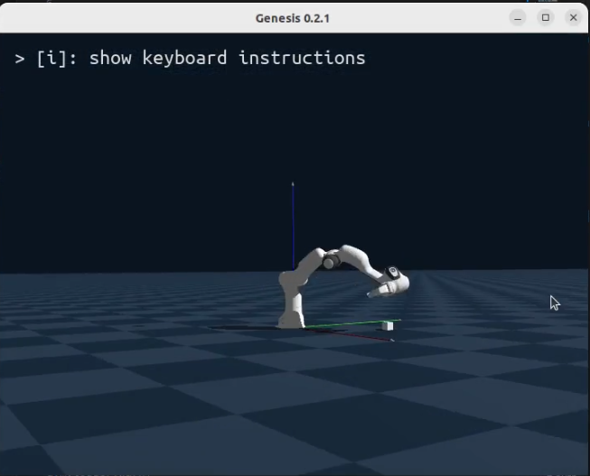

# Custom Gym Environment with Genesis-World

This repository demonstrates how to create a custom OpenAI Gym environment using the [Genesis-World](https://genesis-embodied-ai.github.io/) simulator and train reinforcement learning agents to perform specific tasks using [Stable-Baselines3](https://stable-baselines3.readthedocs.io/).



## Overview

The project aims to:

- **Integrate Genesis-World with OpenAI Gym:** Leverage the capabilities of the Genesis-World simulator within a Gym environment.
- **Design Custom Tasks:** Define specific tasks and reward functions tailored to unique robotic applications.
- **Train RL Agents:** Utilize Stable-Baselines3 to train agents to accomplish the defined tasks effectively.

## Repository Structure

- `custom_env.py`: Defines the custom Gym environment interfacing with Genesis-World.
- `genesis_world.py`: Contains utility functions and classes specific to the Genesis-World simulator.
- `train.py`: Script to train the reinforcement learning agent using Stable-Baselines3.
- `test.py`: Script to evaluate the performance of the trained agent.
- `requirements.txt`: Lists the required Python packages to run the project.

## Installation

1. **Clone the Repository:**

   ```bash
   git clone https://github.com/ohauterville/CustomGymEnvWithGenesisWorld.git
   cd CustomGymEnvWithGenesisWorld

2. **Install Dependencies**

    It's recommend to use a virtual environment

    ```bash
    python3 -m venv venv
    source venv/bin/activate
    ```

    Install the required packages

    ```bash
    pip install -r requirements.txt
    ```

3. **Usage**

    **Train** the agent:
  
    ```bash
    python train.py
    ```

    This will create a *models* folder and a *logs* folder. The *run_id* is the 8 first digits of the file crated in these folders (the datetime as MMDDHHMM).

    **Visualize** the training metrics:
    In an other terminal, run:

    ```bash
    tensorboard --logdir='logs' --port 6006
    ```

    Click on the link.

    **Test** the agent:

    ```bash
    python test.py --run_id MMDDHHMM
    ```


## Disclaimer
This is a personal project. There are more efficient ways to accomplish this with pretrained enviroment and predesigned tasks (like using ManiSkill). But my goal is to learn the details of RL for robotics so I can design more complex tasks and environments in the future.

Olivier H.
